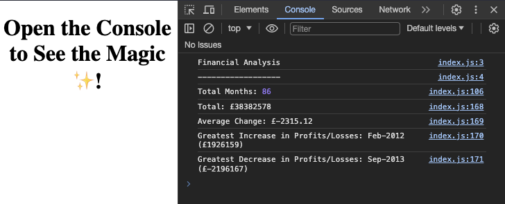

# console-finance-omg

## Description
This application analyses the financial records of a company (provided in a dataset).
It should calculate:
*The total number of months included in the dataset.
*The net total amount of Profit/Losses over the entire period.
*The average of the changes in Profit/Losses over the entire period.
*The greatest increase in Profit/Losses (date and amount) over the entire period.
*The greatest decrease in Profit/Losses (date and amount) over the entire period.

## Instructions
As it says, Open the Console to See the Magic ✨!

## Screenshot
When code is opened in the browser resulting analysis on the right side where the console is, looks like this:  

### Deployed Application
[Console Finances App](https://codeswitchstudio.github.io/console-finance-omg)
